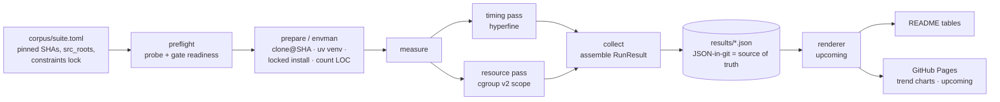
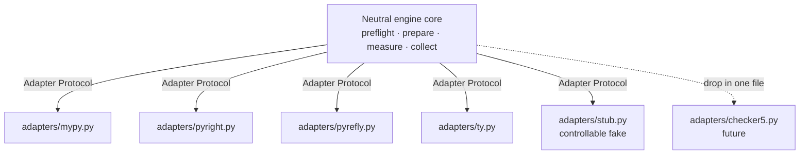
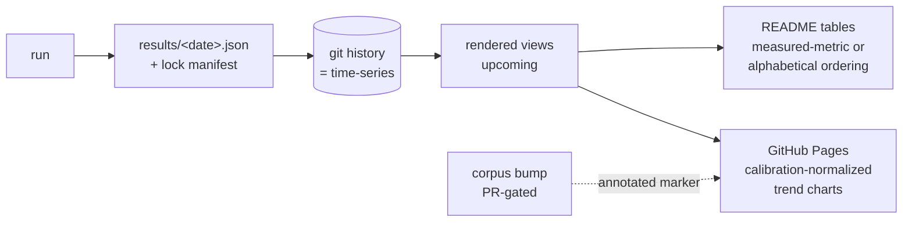

# typebench

A neutral, reproducible benchmark of Python type-checker performance — measuring execution time, peak memory, and throughput for **mypy**, **pyright**, **pyrefly**, and **ty** across a curated corpus of real-world projects.

> **Status:** The benchmark engine, four real checker adapters, corpus/envman/preflight, cgroup v2 memory + thread tracks, and the calibration baseline are implemented. The results envelope, suite orchestration, renderer, and the GitHub Pages trend site are in active development (current milestone). Only the `run` and `preflight` commands ship today.

The single product of this project is **trust in the numbers**. Everything below serves that goal.

---

## Table of Contents

- [Introduction](#introduction)
- [What it is](#what-it-is)
- [What it does](#what-it-does)
- [Prerequisites & dependencies](#prerequisites--dependencies)
- [Installation](#installation)
- [Usage](#usage)
- [How it works](#how-it-works)
- [Architecture](#architecture)
- [Project status & roadmap](#project-status--roadmap)
- [Results](#results)
- [Contributing](#contributing)
- [License](#license)
- [Acknowledgements & see also](#acknowledgements--see-also)

---

## Introduction

Python now has four actively developed static type checkers — mypy, pyright, pyrefly, and ty — with very different implementation strategies and very different performance characteristics. Claims about "how fast" each one is circulate widely, usually without a defensible, repeatable methodology behind them.

typebench exists to replace anecdote with measurement. It is a **credibility-first** benchmark: the methodology is designed so that the mypy, Microsoft (pyright), and Astral (ty) teams — and anyone else — can re-run it, audit it, and cannot reasonably dismiss it. The results are static artifacts in a git repository, designed to be **cited and re-run by anyone**.

### Neutrality is the design constraint, not a footnote

This project is **not** "pyrefly vs. the world." pyrefly is **one entrant, treated identically** to the other three. This principle is non-negotiable and shapes the entire architecture:

- No "winner" framing, no editorializing, no pyrefly-favorable defaults anywhere.
- The normalized configuration is equally fair (or equally unfair) to every entrant.
- Results are ordered by the **measured metric** (for example, fastest-first) or alphabetically. Ordering by a measured quantity is the point of a performance benchmark; it is distinct from the editorializing this project prohibits.
- The engine core knows nothing tool-specific. Each checker lives behind one declarative adapter, so **adding a fifth checker is a drop-in change** and no entrant is privileged in the design.

If any sentence in this repository ever reads as advocacy for a particular checker, that is a bug.

### Who it is for

Maintainers of the checkers, teams choosing a checker for a large codebase, and anyone who wants a reproducible, hardware-normalized, time-series view of Python type-checker performance that they can verify themselves.

---

## What it is

typebench is a **generic measurement engine plus a curated suite expressed as data**:

- **Four checkers under test:** mypy, pyright, pyrefly, ty — each behind a single declarative adapter.
- **Corpus-as-data:** the benchmark targets are declared in [`corpus/suite.toml`](corpus/suite.toml), not baked into code. Each entry pins a repository to a release-tag commit SHA, names its first-party source roots, gives an explicit install recipe, and references a checked-in constraints lock so third-party imports resolve identically over time. The engine consumes this file. Benchmark a curated entry with `typebench run --corpus corpus/suite.toml --corpus-project <name>`; point the engine at an arbitrary checkout with `--project <name>` plus one or more `--src-root` dirs (and `--venv` for the real checkers). `typebench suite` (Plan 5) runs the whole matrix in one shot.
- **JSON-in-git as the source of truth:** every run emits a structured JSON record. The committed git history of those records *is* the time-series. The README and the (upcoming) GitHub Pages site are **rendered views** of that JSON — never the other way around, and never hand-edited.

Measurement itself is **delegated to trusted, independent tools** rather than re-implemented: [`hyperfine`](https://github.com/sharkdp/hyperfine) for wall-time and cgroup v2 (via `systemd-run --user --scope`) for peak memory and CPU-time. The harness orchestrates; it does not invent its own stopwatch. This is a deliberate credibility choice — the numbers come from tools an auditor already trusts.

---

## What it does

For each `(project × tool × thread-mode)` combination, typebench produces:

- **Wall time** — min, median, mean, and stddev, plus a dispersion measure (IQR/MAD). `min` is retained as the noise-robust comparator on shared, right-skewed runners; stddev alone is not trusted because it assumes near-normal data.
- **Peak cgroup memory** — read from cgroup v2 `memory.peak` over the full process tree, reported as min/median/max across repeated runs. This is explicitly labelled **peak cgroup memory, not RSS**. cgroup v2 charges all memory used by the scope and its descendants (child processes, worker threads, page cache, kernel structures). That is precisely the *fair* cross-tool number: it captures pyright's Node process and the worker threads that pyrefly/ty/mypy spawn, all of which a plain `/usr/bin/time -v` RSS reading would miss or undercount.
- **CPU time** — user + sys, taken from the same scope's `cpu.stat` (not from hyperfine).
- **Parallel efficiency** — CPU-time ÷ wall-time. Approximately 1.0 for the single-threaded tools.
- **Throughput (kLOC/s)** — computed against a **canonical analyzed-code-LOC denominator that is identical across all tools** (the first-party source set defined by the normalized config), never raw total LOC. A headline throughput whose denominator differs from the measured work is never published.
- **Files checked** — parsed from each tool's machine-readable output.
- **Diagnostics count** — reported as **data only, never a ranking.** Diagnostic counts are not comparable across tools (different rules, different default strictness) and are deliberately kept out of headline tables so they cannot be misread as a soundness ranking.

### Failure taxonomy

Every run resolves to exactly one class. Diagnostics found are *success*, not failure — type checkers exit nonzero when they find type errors, and that is normal operation. Only genuine failures are excluded from headline aggregates, and **failures are always recorded, never silently dropped** — a missing bar must read as "did not compete," never as "fast."

| Class | Meaning | Recorded as |
|-------|---------|-------------|
| `clean` | Checked, zero diagnostics | measured |
| `diagnostics` | Checked, diagnostics found | measured |
| `failed{env}` | Environment / setup / import-resolution error | failed, excluded from aggregate |
| `failed{crash}` | Panic, segfault, internal error, or signal death | failed, excluded |
| `failed{timeout}` | Exceeded the per-run timeout cap | failed, excluded |
| `failed{oom}` | OOM-killed | failed, excluded |

Each adapter owns the mapping from its real exit codes and signals to these classes; the original exit code is always preserved in the result record.

---

## Prerequisites & dependencies

### Python runtime

- **Python 3.12+**
- [`pydantic`](https://docs.pydantic.dev/) `>=2.6` — on-disk schemas with `extra="forbid"` so unknown fields fail loudly.
- [`typer`](https://typer.tiangolo.com/) `>=0.12` — the CLI.

These are the only runtime dependencies; they are declared in [`pyproject.toml`](pyproject.toml).

### Tooling

- [`uv`](https://docs.astral.sh/uv/) — environment management for typebench itself and for building each corpus project's isolated, locked venv.

### System tools (required vs. optional/gated)

typebench delegates measurement to external tools and degrades gracefully when an optional one is absent. Be aware of which is which:

| Tool | Role | Required? | Behaviour when absent |
|------|------|-----------|-----------------------|
| `hyperfine` | Wall-time timing pass — the **primary** metric | **Required for any benchmark result** | The pipeline does not error — it still classifies the run and records memory, CPU-time, and calibration — but wall time, parallel efficiency, and throughput are all `null`. That is a recorded run, not a benchmark. You need hyperfine for real numbers. |
| `git` | Clone corpus projects at a pinned SHA | Required for corpus runs | Corpus prepare fails. |
| `uv` | Build isolated, locked per-project venvs | Required | Environment cannot be prepared. |
| cgroup v2 + `systemd-run --user --scope` | Peak-memory / CPU-time pass | Optional (Linux-only) | The resource pass auto-skips; the run is **timing-only** (wall time still recorded). **macOS local runs are timing-only by design** (no cgroups). |
| `taskset` (util-linux) | CPU affinity for the `1-core-constrained` floor | Optional | The affinity floor cannot be enforced for that track; `thread_mode_enforced` stays `false` so the record never claims a pin it did not apply. |
| `tokei` | Code-LOC counting for the throughput denominator | Optional (gated) | Falls back to physical line counting. |
| `node` | Required only by the **pyright** adapter | Conditionally required | pyright cannot run without it; the other three are unaffected. |

Read the split this way: **`hyperfine` + `uv` + `git`** are what you need to produce real numbers; the cgroup pass, `taskset`, and `tokei` each *add a dimension* (memory, the 1-core floor, code-LOC throughput) and degrade honestly when absent rather than silently distorting the numbers that *are* recorded.

---

## Installation

```bash
git clone <repository-url> typebench
uv sync
```

`uv sync` provisions the project's own virtual environment from `uv.lock`. After that, the CLI is available via `uv run typebench ...`.

To run the full quality gate (see [Contributing](#contributing)):

```bash
uv run ruff format && uv run ruff check && uv run pyrefly check && uv run pytest
```

---

## Usage

Two commands ship today: **`typebench run`** (measure one project with one tool) and **`typebench preflight`** (verify a corpus project is checkable by each tool before a real run). The `suite` orchestration and `render` commands described in the [roadmap](#project-status--roadmap) are upcoming and **do not exist yet**.

All flags below are transcribed from the live CLI. Run `uv run typebench run --help` or `uv run typebench preflight --help` to confirm.

### Quick demo (stub checker, no corpus)

The in-package `stub` checker drives a controllable fake type checker, so you can exercise the full pipeline with no real checker, corpus, or network:

```bash
uv run typebench run --tool stub --project demo --output results.json
```

If `hyperfine` is not on `PATH`, the run still classifies and records, with `timing: null`.

### Real single-tool corpus run

For a real checker, point the run at a corpus project. typebench clones it at the pinned SHA, builds an isolated locked venv, derives the normalized config, and runs the measurement passes:

```bash
uv run typebench run \
  --tool pyright \
  --corpus corpus/suite.toml \
  --corpus-project httpx \
  --thread-mode all-cores \
  --cache-root typebench-cache \
  --output results-httpx-pyright.json
```

In corpus mode, the source roots, target Python version/platform, exclude globs, and venv interpreter are all derived from the prepared project — you do not pass `--src-root` or `--venv` yourself (combining them with `--corpus-project` is rejected).

To run a real checker **without** the corpus machinery, supply the source roots and a venv interpreter directly. `--src-root` is repeatable and required for real tools (the stub is exempt):

```bash
uv run typebench run \
  --tool mypy \
  --project my-lib \
  --src-root src/my_lib \
  --venv /path/to/project/.venv/bin/python \
  --thread-mode 1-core-constrained \
  --output results-mylib-mypy.json
```

#### Why `--cache-root` is a non-hidden directory

The default cache root is `typebench-cache` — **deliberately not** a dot-directory like `.typebench-cache`. pyrefly skips dot-directories during file discovery, so a hidden cache would make the cloned corpus invisible to **pyrefly alone**: it would see zero files, classify as `failed{env}` — recorded as a failure but excluded from the headline aggregates — while the other three tools ran normally. A tool-asymmetric cache location is a neutrality defect, so the default is plain and you should keep it plain when overriding it. (This rationale is documented inline in `src/typebench/cli.py`.)

#### Useful `run` options

| Option | Default | Purpose |
|--------|---------|---------|
| `--tool` | *(required)* | `mypy`, `pyright`, `pyrefly`, `ty`, or `stub`. |
| `--output` | *(required)* | Where to write the result JSON (parent dir must be writable). |
| `--thread-mode` | `all-cores` | `all-cores` or `1-core-constrained` (see below). |
| `--runs` | `10` | hyperfine timed runs. |
| `--warmup` | `3` | hyperfine warmup runs (stabilize page cache / CPU turbo; never warm a checker cache). |
| `--mem-runs` | `3` | Resource-pass repeats (≥1; ≥3 for official numbers). |
| `--measure / --no-measure` | `--measure` | Run the cgroup memory/CPU pass (auto-skips if unavailable). |
| `--calibrate / --no-calibrate` | `--calibrate` | Time the calibration workload for VM-to-VM trend normalization. |
| `--calib-runs` | `5` | Calibration workload repeats (≥1). |
| `--timeout` | `900.0` | Per-invocation timeout in seconds (→ `failed{timeout}`). |
| `--src-root` | — | First-party source dir (repeatable; required for real tools). |
| `--corpus` / `--corpus-project` | — | Derive config from `suite.toml` for the named project. |
| `--cache-root` | `typebench-cache` | Where prepared clones/venvs are cached. |

### Thread modes

The `--thread-mode` flag selects between the two tracks the spec defines (§5.3). A literal uniform "1 thread" is **not** achievable across all four tools and is not claimed:

- **`all-cores`** (default) — real-world UX. mypy and pyright are single-threaded by nature, so this track varies only pyrefly and ty. That is stated up front, in the single-threaded tools' favor, so the track is not mistaken for a strawman.
- **`1-core-constrained`** — an algorithmic floor. The uniform mechanism is **CPU affinity to a single core** (via `taskset`) for every tool, plus each adapter's best-effort parallelism cap. It is named "1-core constrained," not "1 thread," precisely because pinning a parallel tool to one core forces its threads to contend on that core rather than truly running a single worker — a distinction that is documented, not hidden. Each per-tool cap carries a `hard_cap: true|false` honesty flag.

### Preflight

`preflight` prepares a corpus project and probes each tool once, gating readiness so an environment-setup failure never quietly reshapes the official benchmark. By default it probes all four real checkers; `--tool` is repeatable to narrow the set.

```bash
uv run typebench preflight \
  --corpus corpus/suite.toml \
  --project httpx \
  --output preflight-httpx.json
```

A project that is not ready exits nonzero, prints the reason, and is logged loudly.

---

## How it works

The engine pipeline is **preflight → prepare → measure → collect → render**.

1. **preflight** (`preflight.py`) — clones and prepares a corpus project, probes each tool once, records the self-reported-vs-canonical file-count divergence, and gates readiness. Corpus health is a *gate*, not best-effort: a project that fails is excluded from that run only, logged, and surfaced.
2. **prepare** (`envman.py`) — clones the project at its pinned SHA, builds an isolated `uv` venv against the pinned Python version, installs dependencies pinned to the checked-in constraints lock, freezes and verifies the result, and counts first-party LOC. Everything is behind a fingerprinted cache that rebuilds on stale config and cleans up partial failures.
3. **measure** — two passes:
   - **timing** (`timing.py`) — `hyperfine --warmup W --runs N --prepare "<clear-cache>"`, parsed from hyperfine's JSON output.
   - **resource** (`measure.py`) — a second pass under a transient cgroup v2 scope (`systemd-run --user --scope`), reading `memory.peak`, `memory.stat`, and `cpu.stat` *before the scope tears down*. Capability-gated, with a timing-only fallback on macOS/CI.
4. **collect** (`collector.py`) — assembles one `RunResult` from the probe and the timing/resource passes, with the environment fingerprint.
5. **render** *(upcoming)* — turns the committed JSON records into README tables and GitHub Pages data files.

### The exit-code wrapper

Type checkers exit nonzero when they find diagnostics — which is *success*, not a measurement failure — but hyperfine aborts on any nonzero exit by default. So `wrapper.py` is invoked as hyperfine's per-run command. It runs the real checker, captures the real exit code, stdout, stderr, signal, timeout flag, and OOM flag, and then **exits 0 to hyperfine for any measured-success class** (clean *or* diagnostics) while propagating a nonzero code for genuine failures so they are recorded as `failed{reason}`. The real exit code is always preserved in the record. The wrapper never raises — a timeout, signal death, or missing binary all become a recorded result.

### What "cold" means

v1 measures **cold single-shot** runs. Cold means **no checker cache and no daemon** — the per-tool cache is cleared or disabled before every measured run via each adapter's `clear_cache`. The **OS page cache is deliberately warm**: we are benchmarking the checker, not disk reads, so hyperfine warmups leave project source in the page cache to stabilize variance. Because the checker cache is cleared on every `--prepare`, warmups never warm a checker cache; the two settings do not contradict.

### Calibration baseline

Headline trends span weeks, and each weekly run can land on a different physical VM, possibly a different CPU model. To keep VM-to-VM hardware variance from masquerading as a checker change, every run also times a fixed, dependency-free CPU-bound reference workload (`calibration.py`, `calib-pyloop-v1`). Numbers are reported both raw and **normalized to that baseline**, so cross-time trends survive the hardware lottery.

### The normalized config contract

Official numbers always use one **normalized configuration** that equalizes *observable inputs* rather than pretending the tools are rule-for-rule identical:

- The **same first-party file set** per tool (also the throughput denominator).
- The **same target Python version and platform**.
- **All function bodies analyzed** (mypy runs with `--check-untyped-defs`; the others analyze all bodies by default), so no tool gets a free win by skipping untyped code.
- **Third-party deps installed so imports resolve**, but diagnostics emitted on first-party code only.
- **Stock default rule sets**, **no plugins** in the headline track. Vendored, generated, and test files are excluded.
- A **hash of the resolved config** is stamped on every result.

Per-tool and per-project overrides exist for exploration but are never used for official numbers.

### Reproducibility & the lock manifest

Checkers always float to latest, which buys "always current" at the cost of historical reproducibility — unless every run is fully pinned in its own record. Each result therefore carries a lock manifest: all four tool versions and their install sources, the exact installed project-dependency versions (uv lock hash + resolved versions), Node/npm/uv/Python versions, the full platform fingerprint (OS, kernel, CPU model, core count, memory, cgroup v2 availability), the project SHA, the normalized-config hash, the calibration baseline id, and the corpus suite version. This makes any historical run re-creatable and lets trends be segmented (for example by CPU model) and attributed (checker bump vs. corpus bump vs. dep bump).

---

## Architecture

A neutral core engine, pluggable checker adapters, and a declarative corpus. Python, `uv`-managed, fully synchronous. Measurement delegated to `hyperfine` (timing) and cgroup v2 (peak memory + CPU-time).

### Engine pipeline



### Adapter-driven design

The engine core is neutral by construction: it knows nothing tool-specific. Every checker's specifics — install/verify, version, command construction, parallelism cap, cache clearing, output parsing, and exit-code classification — live in exactly one declarative adapter. Adding a fifth checker is dropping in one adapter and touching nothing else.



### Data flow: JSON-in-git as a time-series



### Module layout

From the package under `src/typebench/` (see [`AGENTS.md`](AGENTS.md)):

- **`taxonomy.py`** — pydantic-free, stdlib-only on-disk enums (`ResultClass`, `ThreadMode`, `FailurePhase`); imported on the measured path, so kept lightweight.
- **`models.py`** — pydantic v2 schemas (`RunResult`, `TimingStats`, `EnvFingerprint`, …) with `extra="forbid"`.
- **`env.py`** — the environment fingerprint.
- **`corpus.py`** — `CorpusProject`, `SizeBucket`, `load_suite`; corpus-as-data loading with exclude validation and the optional constraints lock.
- **`counting.py`** — `count_first_party`, the neutral throughput denominator.
- **`normalized_config.py`** — `NormalizedConfig` and the default excludes.
- **`envman.py`** — `prepare_project`: clone / venv / locked install / freeze+verify / count, behind a fingerprinted cache.
- **`preflight.py`** — `preflight_project`: probe each tool, record self-vs-canonical file-count divergence, gate readiness.
- **`wrapper.py`** — `RawRun`, `run_command`, exit-code classification; the per-run command hyperfine invokes. Pydantic-free.
- **`timing.py`** — the hyperfine pass and `parse_hyperfine_json`.
- **`collector.py`** — `run_single`, the probe→time pipeline that assembles one `RunResult`.
- **`measure.py`** — the cgroup v2 resource pass (peak memory + CPU-time + OOM) under a transient `systemd-run --scope`. Pydantic-free, capability-gated.
- **`calibration.py`** — the fixed dependency-free CPU workload timed per run for trend normalization. Pydantic-free.
- **`adapters/`** — `base.py` (the `Adapter` Protocol, `ParallelismCap`) plus one module per checker (`mypy`, `pyright`, `pyrefly`, `ty`) and the `stub`. The only tool-specific code in the project.
- **`cli.py`** — the Typer app exposing `run` and `preflight`.

---

## Project status & roadmap

**Implemented today:**

- The benchmark engine spine: preflight → prepare → measure → collect.
- Four real checker adapters (mypy, pyright, pyrefly, ty) plus a controllable stub.
- Corpus-as-data loading, `envman` isolated locked venvs, and the preflight readiness gate.
- The cgroup v2 resource pass (peak memory + CPU-time + OOM), both thread tracks (`all-cores`, `1-core-constrained`), and the calibration baseline.
- The `run` and `preflight` CLI commands.

**In active development (current milestone):**

- The results **envelope** and **suite orchestration** (a `suite` command to run the whole corpus × tools × thread-modes matrix).
- The **renderer** (a `render` command) that turns committed JSON into README tables.
- The **GitHub Pages** trend site rendering calibration-normalized series.

**Automation roadmap:**

- **Weekly checker runs** (checkers float to latest → weekly checker deltas).
- **Monthly, PR-gated corpus bumps** — proposed as a pull request carrying a preflight pass for every bumped project, a LOC delta, a dependency diff, and the rendered chart annotation; never a blind commit.
- CI automation and per-PR regression alerts against the time-series.

Nothing above the "implemented today" line ships yet, and this README does not claim otherwise.

---

## Results

Once the suite runner and renderer land, the table below will be filled automatically from the committed JSON records. Everything between the `TYPEBENCH:BEGIN`/`TYPEBENCH:END` markers is **auto-generated and must never be hand-edited** — the raw JSON under `results/` is the source of truth, and both this README and the GitHub Pages site are rendered views. Hand-written prose (like this paragraph) lives *outside* the markers so regeneration never clobbers it.

<!-- TYPEBENCH:BEGIN -->
_No results published yet. Generated tables will appear here once the suite runner lands._
<!-- TYPEBENCH:END -->

---

## Contributing

Contributions are welcome. Before reading further, read [`AGENTS.md`](AGENTS.md) (engineering rules, module layout, domain invariants) and the [design spec](docs/superpowers/specs/2026-06-07-typebench-design.md) (the source of truth for purpose and methodology).

### The golden rule

This is a **measurement tool**; the only product is trust in the numbers. When in doubt, prefer the honest, conservative, reproducible choice over the convenient one. Every rule below serves that.

### Quality gate

The following must all be green before anything is considered done. Run it locally before declaring work done; pre-commit enforces `ruff` + `pyrefly` on commit (not `pytest`), and CI automation that runs the full gate is a later milestone (Plan 6):

```bash
uv run ruff format && uv run ruff check && uv run pyrefly check && uv run pytest
```

pyrefly runs at `preset = "strict"` because typebench **dogfoods the checker it benchmarks** — keep it at zero errors. If a suppression is ever unavoidable, use `# pyrefly: ignore[<kind>]` with a reason, never a blanket `# type: ignore`. Every function, tests included, is fully type-annotated.

### Expectations

- **Test-driven development** — a failing test first; the Prove-It pattern for bugs. Drive every taxonomy class deterministically through the stub adapter and the in-package fake checker; no real checker is required for the test suite.
- **Conventional Commits with a required scope** — atomic commits whose body explains the *why*. Scopes in use include `models`, `taxonomy`, `env`, `wrapper`, `timing`, `adapters`, `collector`, `cli`, `corpus`, `envman`, `preflight`, `counting`, `measure`, `calibration`, `docs`, `spec`, `plan`. **No AI/assistant attribution** in commit messages or PR bodies — commits read as the author's own work.
- **On-disk schema is a stability contract.** Changing `RunResult` fields or taxonomy string values, changing a quality gate, or adding a runtime dependency requires asking first.

---

## License

Released under the MIT License — see [`LICENSE`](LICENSE).

---

## Acknowledgements & see also

- The full methodology lives in the [design spec](docs/superpowers/specs/2026-06-07-typebench-design.md); engineering conventions and module responsibilities in [`AGENTS.md`](AGENTS.md).
- typebench builds on tools it does not try to replace: [`hyperfine`](https://github.com/sharkdp/hyperfine) for wall-time, [`tokei`](https://github.com/XAMPPRocky/tokei) for code-LOC counting, and [`uv`](https://docs.astral.sh/uv/) for environment management. The credibility of the numbers rests on delegating measurement to tools an auditor already trusts.
